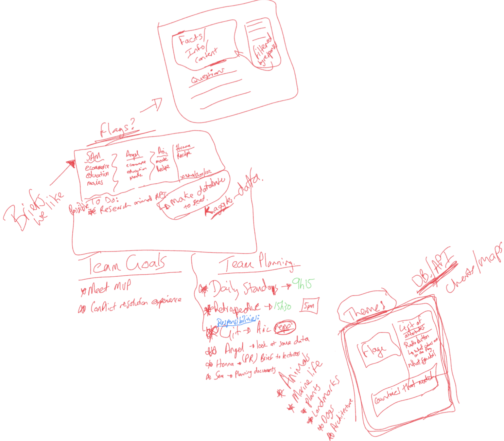

# Informal Minutes of Meetings & Planning Decisions

## Contributors:

- Angel Gonzáez Camejo (AC)
- Aric Gilinsky (AG)
- Hanna Durham (HD)
- Sam Bartram (SB)

## <u>Thursday - 1 June 2023</u>

1 hour brainstorming session:

<!--  -->

### What did we decide:

- Eliminated the briefs we did not want to work on.
- Narrowed down the briefs we wanted to explore.
- Explored the option of making our own json to seed our database.
- Explored possible themes for the Educational App and the app's functionality with a very rough wireframe.
- Agreed on our agile practices to be followed during our daily sprints.

## <u>Friday - 2 June 2023 (REMOTE WORKING)</u>

### Planning Decisions & Progress Made:

- Zoom link organised by SB and shared.

- Our version control. Remote Repository set up completed by AG. All invites accepted. Repo cloned onto local repositories and practice with git push and pull requests done by AC & AG via screen sharing on Zoom call.

- Revisited the brief and our ideas for our app to ensure they met the targets of mvp.

  - Our user must be able to:
    - view some educational content on a particular topic.
    - be able to interact with the page to move through different sections of content.
    - Any specific features or functions we want to implement.
  - We decided:
    - Our app will display pictures/names of all 8 planets in the solar system along with facts. The user interacts by answering questions about the planets (regarding attributes of the planets). The planets filter when they meet those attributes.
    - Can add links for additional reading.

- Discussed and decided our task goals for our daily sprints next week (Major Milestones / deadlines / deliverables).

  - All agreed that by end of day each day we would like a working deliverable.
  - Monday: 09:15 Stand-Up. Split up into pairs for backend and frontend. Retrospective @ 15:30. merges, & should have completed a barebones - components, pages, server & routes.
  - Tuesday: 09:15 Stand-Up. <strong> MVP COMPLETE TODAY </strong>. Retrospective @ 15:30 - merges.
  - Wednesday: 09:15 Stand-Up. Work on the form to add a new planet. Retrospective @ 15:00. Begin to work on presentation.

- A design for UI - wireframe / mockup.

- How will the content be presented and how will our user navigate through it.

- Visual elements, colour schemes. Any branding ideas.
  *https://colorhunt.co/ for colour palettes.*

- React, Express and MongoDB are our primary technologies in our stack.
- Additional libraries or frameworks to consider?

  - Possible animations of information with react libraries. Information flow onto screen.
  - API integration (NASA) for images on the planet pages.

- AC accessed kaggle and downloaded csv from https://www.kaggle.com/datasets/iamsouravbanerjee/planet-dataset. Converted to JSON via zoom screen sharing discussed and implemented data cleaning.

- Decisions for frontend and backend:

  - Frontend

    - Container = App.js / Routes
    - Components:
      - Navbar
      - PlanetForm
      - PlanetList
      - IndividualPlanet
      - PlanetRevision
    - Pages:
      - Home (a "how-to-page" for interacting with the app).
      - Index (links to each planet page)
      - Form (interactivity)
      - Planet Pages (One for each planet).
        - All educational content with images of the planet linked to NASA api with a button requesting next image.
      - Make your own planet form (add info, select image, update)
      - About us page - who are we.

  - Backend Routes
    - get for all
    - get for one.
      For the create own planet
    - post, delete (put for update as possible extension).

- Testing decisions. Time dependant.

- Possible names: Planet Discovery / Planet Holmes /

- If we had more time: https://openai.com/blog/dall-e-api-now-available-in-public-beta

### Dataflow sketch

<!--  -->

<!--  -->

## <u>Monday - 5 June 2023</u>

## <u>Tuesday - 6 June 2023</u>

## <u>Wednesday - 7 June 2023</u>

## <u>Thursday - 8 June 2023</u>
